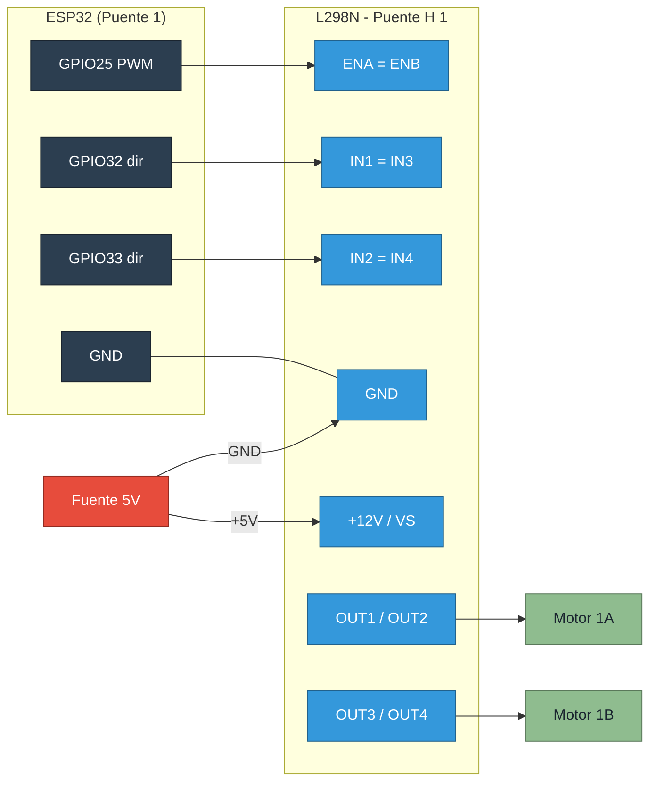

# Guia detallada: conexion de los motores al puente H

Esta guia explica **paso a paso** como conectar los **6 motores DC de 5V** a los **3 puentes H**
del Seismulator, segun la logica que espera `main.py` (1 puente = 1 control de la app = 2 motores).

> Puente H de referencia: **modulo L298N** (el mas comun). Si usas otro driver (L9110S,
> TB6612FNG, DRV8833) los conceptos son los mismos, solo cambian los nombres de los pines.

---

## 1. Idea general

Un **puente H** es un circuito que permite controlar un motor DC: encenderlo, apagarlo,
regular su velocidad (con PWM) e invertir su giro. La ESP32 **no mueve los motores**;
solo manda senales de control de bajo voltaje al puente H, y **el puente** entrega la
corriente y el voltaje (5V) a los motores desde una **fuente externa**.

En este proyecto:

- Hay **3 puentes H**.
- Cada puente mueve **2 motores a la vez, a la misma velocidad y direccion**.
- Por eso la app solo necesita **3 controles** (1 por puente) para 6 motores.

```
   App (3 sliders) ──► ESP32 (PWM + direccion) ──► 3 Puentes H ──► 6 Motores (5V)
        control                bajo voltaje            potencia        fuerza
```

---

## 2. Terminales del modulo L298N

El L298N tiene **dos canales** (A y B), o sea puede mover **2 motores** por modulo. Eso
encaja perfecto: **1 modulo L298N = 1 puente del proyecto = 2 motores**.

| Terminal | Que es | A donde va |
|---|---|---|
| `+12V` (o `VCC`/`VS`) | Alimentacion de los motores | **+5V de la fuente externa** |
| `GND` | Tierra | GND comun (fuente **y** ESP32) |
| `+5V` | Salida/entrada de 5V de la logica | Ver seccion 4 (jumper) |
| `ENA` | Habilita/PWM del canal A | GPIO PWM de la ESP32 |
| `IN1`, `IN2` | Direccion del canal A | 2 GPIO de la ESP32 |
| `IN3`, `IN4` | Direccion del canal B | 2 GPIO (en este proyecto: unidos a IN1/IN2) |
| `ENB` | Habilita/PWM del canal B | En este proyecto: **unido a ENA** |
| `OUT1`, `OUT2` | Salida al motor A | Bornes del **Motor A** |
| `OUT3`, `OUT4` | Salida al motor B | Bornes del **Motor B** |

---

## 3. Como se controla cada canal

Para **un** canal (ejemplo canal A) el comportamiento es:

| ENA (PWM) | IN1 | IN2 | Resultado |
|:---:|:---:|:---:|---|
| 0% | x | x | Motor detenido (sin fuerza) |
| 0–100% | 1 | 0 | Gira **adelante** a la velocidad del PWM |
| 0–100% | 0 | 1 | Gira **atras** a la velocidad del PWM |
| x | 1 | 1 | Freno (no usar) |
| x | 0 | 0 | Libre / sin energizar |

En este proyecto la direccion es **fija "adelante"**: el firmware deja `IN1=1`, `IN2=0`
y solo varia la **velocidad con ENA (PWM)**. Por eso para simular el sismo basta subir
y bajar el PWM.

---

## 4. Alimentacion: lo mas importante

Tienes que decidir de donde sale la energia. **Dos reglas que nunca se rompen:**

1. **Los motores se alimentan desde una fuente de 5V por el terminal `+12V`/`VS` del L298N**,
   nunca desde los pines de la ESP32 (un GPIO no aguanta la corriente de un motor).
2. **GND comun**: la `GND` de la fuente, la del L298N y la `GND` de la ESP32 deben estar
   **todas unidas**. Sin tierra comun, las senales de control no funcionan.

### Sobre el jumper de "+5V" y el regulador del L298N

El L298N trae un jumper junto al terminal `+5V`:

- **Con motores de 5V** (nuestro caso) y fuente de 5V: lo mas seguro es **quitar el jumper**
  y alimentar la logica del modulo aparte (con 5V), porque el regulador interno espera
  una entrada mayor (7–12V) para generar 5V estables. Alternativamente, alimenta el L298N
  con ~6–7V y deja el jumper puesto.
- **Nunca** alimentes la ESP32 desde el `+5V` del L298N si no estas seguro del voltaje;
  alimenta la ESP32 por su USB o pin `VIN` de forma independiente.

> Recomendacion practica para 5V: usa una fuente de 5V con suficiente corriente
> (suma el consumo de los 6 motores; pequenos motores de vibracion ~100–300 mA cada uno),
> alimenta los `+12V` de los 3 modulos en paralelo, y comparte GND con la ESP32.

```
   Fuente 5V (+) ──┬──► +12V/VS  Puente 1
                   ├──► +12V/VS  Puente 2
                   └──► +12V/VS  Puente 3

   Fuente 5V (–) ──┬──► GND Puente 1 ┐
                   ├──► GND Puente 2 ├─ TODAS unidas
                   ├──► GND Puente 3 │  (tierra comun)
                   └──► GND ESP32 ───┘
```

---

## 5. Los puentes del proyecto: ENA=ENB, IN1=IN3, IN2=IN4

Como cada puente debe mover **2 motores igual**, unimos las entradas de los dos canales
para gobernarlos con **un solo set de senales** de la ESP32:

- `ENA` **unido a** `ENB`  → una sola senal de velocidad (PWM) mueve los 2 motores.
- `IN1` **unido a** `IN3`  → misma direccion para los 2 motores.
- `IN2` **unido a** `IN4`  → misma direccion para los 2 motores.

Esos puentes se hacen con un **cable corto entre los pines del propio modulo** (o en la
protoboard). Asi, desde la ESP32 solo salen **3 cables de control por puente**.

> Si NO unes ENA con ENB, el canal B quedaria sin PWM y su motor no giraria (o solo si
> el L298N trae el jumper de ENB puesto, lo que lo dejaria siempre a tope). Por eso es
> importante unirlos.

---

## 6. Cableado completo (los 3 puentes)

### Pines de la ESP32 (definidos en `main.py` -> `HBRIDGES`)

| Puente | ENA (PWM) | IN1 (=IN3) | IN2 (=IN4) | Motores |
|:---:|:---:|:---:|:---:|---|
| 1 | GPIO **25** | GPIO **32** | GPIO **33** | Motor 1A + 1B |
| 2 | GPIO **26** | GPIO **16** | GPIO **17** | Motor 2A + 2B |
| 3 | GPIO **27** | GPIO **13** | GPIO **14** | Motor 3A + 3B |

> El puente **3** se configura con `"reverse": True` en `HBRIDGES`: el firmware le pone
> `IN1=0`, `IN2=1` (al reves que los puentes 1 y 2, que usan `IN1=1`, `IN2=0`). Esto hace
> que sus motores giren en el mismo sentido fisico que los demas. Si aun asi giran al
> reves, intercambia los dos cables del motor en sus terminales `OUT`.

### Conexion de un puente (ejemplo Puente 1)

```
   ESP32                      L298N (Puente 1)                  Motores 5V
   ───────                    ────────────────                  ──────────
   GPIO25 ───────────────►  ENA ──┐
                            ENB ──┘  (cable de union ENA=ENB)
   GPIO32 ───────────────►  IN1 ──┐
                            IN3 ──┘  (cable de union IN1=IN3)
   GPIO33 ───────────────►  IN2 ──┐
                            IN4 ──┘  (cable de union IN2=IN4)

                            OUT1 ─────────────────────────►  Motor 1A (+)
                            OUT2 ─────────────────────────►  Motor 1A (–)
                            OUT3 ─────────────────────────►  Motor 1B (+)
                            OUT4 ─────────────────────────►  Motor 1B (–)

   Fuente 5V (+) ────────►  +12V / VS
   GND (comun) ──────────►  GND   ◄──────── GND ESP32 ──────── GND Fuente
```

Repite exactamente lo mismo para el **Puente 2** (GPIO 26/16/17) y el **Puente 3**
(GPIO 27/13/14).

---

## 7. Diagrama Mermaid del cableado de un puente



---

## 8. Pasos de montaje (orden recomendado)

1. **Sin alimentar nada**, conecta primero las uniones del modulo: `ENA=ENB`, `IN1=IN3`,
   `IN2=IN4` en cada L298N.
2. Conecta los **3 cables de control** de cada puente a sus GPIO de la ESP32.
3. Une **todas las GND**: fuente, los 3 L298N y la ESP32.
4. Conecta los **motores** a `OUT1/OUT2` (motor A) y `OUT3/OUT4` (motor B) de cada modulo.
5. Conecta el **+5V de la fuente** a los `+12V/VS` de los 3 modulos.
6. Revisa el jumper de `+5V` segun la seccion 4.
7. Enciende primero la **ESP32** (USB) y luego la **fuente de motores**.
8. Abre la app (`http://192.168.4.1/`) y prueba el preset **"Ligero"**: los 6 motores
   deben girar suave.

---

## 9. Verificacion y problemas comunes

| Sintoma | Causa probable | Solucion |
|---|---|---|
| Ningun motor gira | Falta GND comun | Une la GND de fuente, L298N y ESP32 |
| Solo gira 1 motor de un puente | `ENA` no esta unido a `ENB` | Pon el cable de union ENA=ENB |
| Motor gira al reves | IN1/IN2 invertidos en ese motor | Intercambia los 2 cables del motor en `OUT` |
| Gira siempre a tope, sin control | ENB con jumper puesto en vez de PWM | Quita el jumper de ENB y unelo a ENA |
| La ESP32 se reinicia al arrancar motores | Caida de tension / fuente debil | Fuente con mas corriente; no alimentes motores desde la ESP32 |
| Motores debiles o calientes el L298N | Voltaje de logica mal (regulador) | Revisa jumper +5V / alimentacion (seccion 4) |

---

## 10. Resumen rapido

- **1 L298N = 1 puente = 2 motores** a la misma velocidad.
- Une **ENA=ENB, IN1=IN3, IN2=IN4** en cada modulo.
- Control desde la ESP32: **ENA=PWM (velocidad)**, **IN1/IN2=direccion (fija adelante)**.
- Motores alimentados por **fuente de 5V** en `+12V/VS`, **nunca** desde los GPIO.
- **GND comun obligatoria** entre fuente, puentes y ESP32.
- Motores en `OUT1/OUT2` (A) y `OUT3/OUT4` (B).
