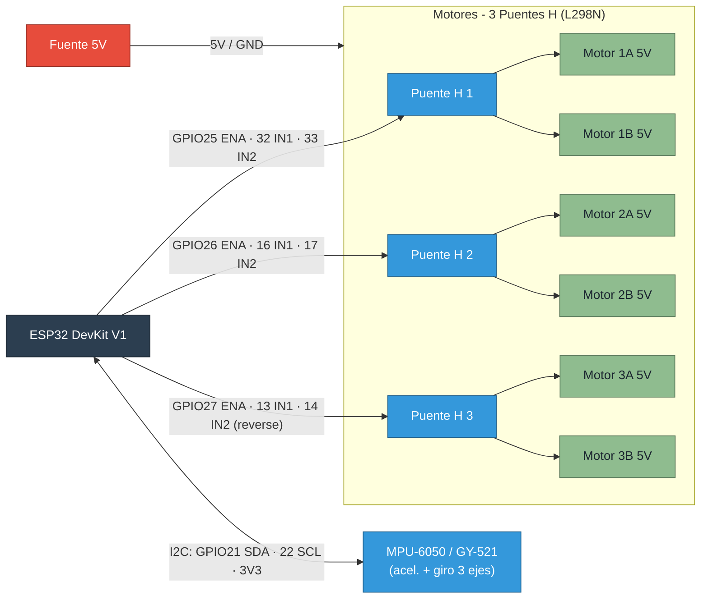
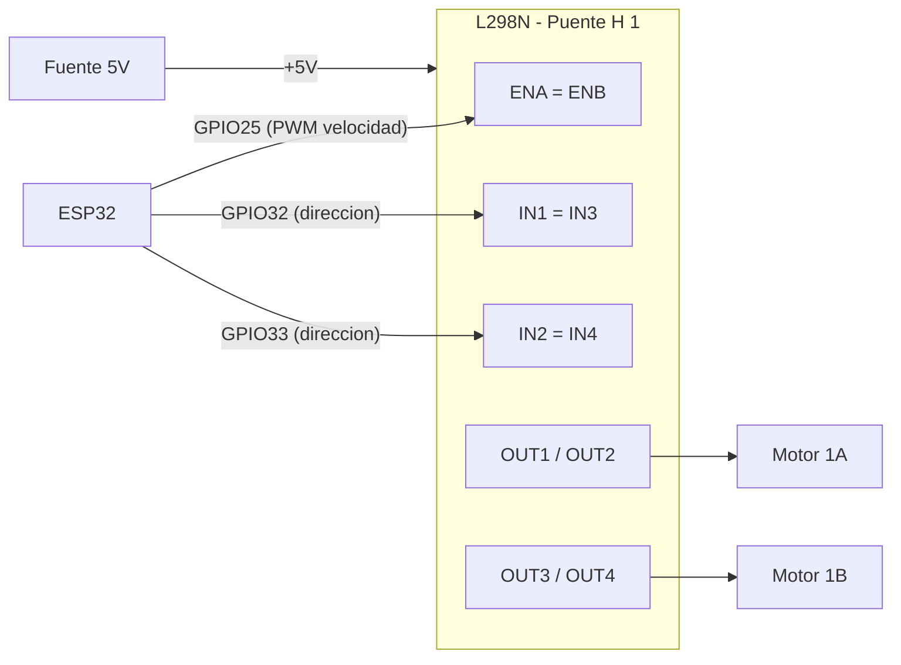

# Actualizacion del Seismulator: hardware, sensor y red UDP

Documento de los cambios añadidos respecto a la version inicial (solo web + 3 motores PWM).
Resume **lo nuevo**, los archivos afectados y el **diagrama de conexion pin por pin** de la ESP32.

> Nota: el firmware actual (`main.py`) **no incluye pantalla TFT**. El monitoreo se hace
> desde la interfaz web (modales "Info" y "Debug") y por UDP multicast.

---

## 1. Que se añadio / cambio

| Area | Antes | Ahora |
|---|---|---|
| Motores | 3 motores directos por PWM | **6 motores DC 5V** vía **3 puentes H** (2 motores por puente) |
| Sensor | `gyro_value` estimado por software | **MPU-6050 / GY-521** real por I2C (accel, giro y temperatura, con fallback a estimacion) |
| Red | Solo HTTP (navegador) | HTTP **+ UDP unicast** (comandos) **+ UDP multicast** (sensor) |
| API web | `/`, `/api/status`, `/api/control` | + `/api/debug` (diagnostico) y soporte CORS (`OPTIONS`) |
| Arquitectura | Bucle bloqueante `accept()` | **Bucle de eventos** no bloqueante (`select.poll`) con tareas periodicas |
| Fiabilidad | `send()` parcial, sin timeout | `send_all`, `settimeout`, `gc.collect()` |

### Archivos

| Archivo | Estado | Contenido |
|---|---|---|
| `mpu6050.py` | **Nuevo** | Driver I2C minimalista del MPU-6050 (accel + giro + temperatura) |
| `main.py` | **Modificado** | Puentes H, lectura de sensor real, modal Debug, bucle de eventos + UDP |
| `firmware_controladora.md` | **Modificado** | Hardware, pinout, protocolo UDP y giroscopio real |
| `hardware_pinout_esp32.md` | **Nuevo** | Este documento |

### Detalle funcional nuevo

- **Puentes H (`HBRIDGES`)**: cada puente usa `ENA`(PWM de velocidad) + `IN1`/`IN2` (direccion fija "adelante"). El puente 3 lleva `"reverse": True` para girar en el mismo sentido fisico que los demas. 1 control de la app = 1 puente = 2 motores a la misma velocidad. La app **no cambia**.
- **`update_gyro()`**: lee el MPU-6050 (accel, giro y temperatura), calcula la intensidad como `|‖accel‖ − 1g|` (acel. dinamica sin gravedad) y la suaviza con filtro exponencial. Si el sensor no responde, usa la estimacion por velocidad.
- **`run_event_loop()`**: multiplexa con `select.poll` el socket HTTP y el socket UDP, y dispara tareas por tiempo: leer sensor (100 ms), mantener el "light boost" y difundir multicast (500 ms).
- **Presets**: `preset_light` arranca a 99% y baja a 40% tras 1 s (`schedule_light_boost`); `preset_moderate` aplica 65%; `preset_intense` aplica 99%.
- **UDP unicast (puerto 5006)**: recibe comandos JSON identicos a `POST /api/control` y responde el estado al emisor.
- **UDP multicast (`224.1.1.10:5005`)**: difunde el estado completo (incluye giroscopio) a todos los suscriptores.

---

## 2. Mapa de pines de la ESP32

> Placa de referencia: **ESP32 DevKit V1 (38 pines)**. Los GPIO son configurables en
> las constantes de `main.py` (`HBRIDGES`, `I2C_*`).

| GPIO | Funcion | Conecta a | Bloque |
|:---:|---|---|---|
| **25** | PWM velocidad | `ENA` + `ENB` Puente H 1 | Motores 1A / 1B |
| **32** | Salida digital | `IN1` + `IN3` Puente H 1 | Direccion (adelante) |
| **33** | Salida digital | `IN2` + `IN4` Puente H 1 | Direccion (adelante) |
| **26** | PWM velocidad | `ENA` + `ENB` Puente H 2 | Motores 2A / 2B |
| **16** | Salida digital | `IN1` + `IN3` Puente H 2 | Direccion (adelante) |
| **17** | Salida digital | `IN2` + `IN4` Puente H 2 | Direccion (adelante) |
| **27** | PWM velocidad | `ENA` + `ENB` Puente H 3 | Motores 3A / 3B |
| **13** | Salida digital | `IN1` + `IN3` Puente H 3 | Direccion (reverse) |
| **14** | Salida digital | `IN2` + `IN4` Puente H 3 | Direccion (reverse) |
| **21** | I2C SDA | `SDA` MPU-6050 | Sensor |
| **22** | I2C SCL | `SCL` MPU-6050 | Sensor |
| **5V/VIN** | Alimentacion | `VCC` puentes H y modulos | Energia |
| **3V3** | Alimentacion logica | `VCC` MPU-6050 | Energia |
| **GND** | Tierra comun | GND de TODOS los modulos | Energia |

---

## 3. Diagrama de conexion

```
                          ┌───────────────────────────┐
                          │        ESP32 DevKit        │
                          │                            │
   ┌──── Puente H 1 ──────┤ GPIO25 ENA1                │
   │  ┌── (L298N) ────────┤ GPIO32 IN1/IN3             │
   │  │                ┌──┤ GPIO33 IN2/IN4             │
   │  │                │  │                            │
   │  │  ┌─ Puente H 2 ─┤ GPIO26 ENA2                  │
   │  │  │  (L298N) ────┤ GPIO16 IN1/IN3               │
   │  │  │           ┌──┤ GPIO17 IN2/IN4               │
   │  │  │           │  │                              │
   │  │  │ ┌ Puente H 3┤ GPIO27 ENA3                   │
   │  │  │ │ (L298N) ──┤ GPIO13 IN1/IN3 (reverse)      │
   │  │  │ │        ┌──┤ GPIO14 IN2/IN4 (reverse)      │
   │  │  │ │        │  │                               │
   │  │  │ │        │  │ GPIO21 SDA ───┐               │
   │  │  │ │        │  │ GPIO22 SCL ──┐│   MPU-6050    │
   │  │  │ │        │  │ 3V3 ────────┐││   (GY-521)    │
   │  │  │ │        │  │ GND ───────┐│││               │
   │  │  │ │        │  └────────────┼┼┼┼───────────────┘
   v  v  v v        v               vvvv
 ┌──────────┐  ┌──────────┐  ┌──────────┐   ┌─────────┐
 │ Motores  │  │ Motores  │  │ Motores  │   │ MPU-6050│
 │  1A 1B   │  │  2A 2B   │  │  3A 3B   │   │  3 ejes │
 │ (5V DC)  │  │ (5V DC)  │  │ (5V DC)  │   └─────────┘
 └──────────┘  └──────────┘  └──────────┘
```

### 3.1 Conexion de cada puente H (L298N) — ejemplo Puente 1

```
   ESP32                         L298N (Puente H 1)              Motores 5V
   ───────                       ──────────────────              ──────────
   GPIO25 ───────────────────►  ENA  ──┐
                                ENB  ──┘ (puente ENA=ENB)        OUT1 ─► Motor 1A +
   GPIO32 ───────────────────►  IN1  ──┐                        OUT2 ─► Motor 1A -
                                IN3  ──┘ (IN1=IN3)
   GPIO33 ───────────────────►  IN2  ──┐                        OUT3 ─► Motor 1B +
                                IN4  ──┘ (IN2=IN4)              OUT4 ─► Motor 1B -
   5V (fuente) ──────────────►  +12V/VCC  (alimentacion motores)
   GND  ─────────────────────►  GND       (tierra comun con ESP32)
```

> Importante:
> - Une **ENA con ENB** e **IN1 con IN3 / IN2 con IN4** en cada modulo para que un
>   solo control mueva los 2 motores del puente a la misma velocidad y direccion.
> - Si tu L298N trae jumper de 5V, puede alimentar la logica; aun asi **comparte GND**
>   con la ESP32. Los motores se alimentan desde la **fuente de 5V**, nunca desde los GPIO.

### 3.2 Conexion del MPU-6050 (GY-521)

```
   ESP32              MPU-6050
   ───────            ────────
   3V3   ──────────►  VCC
   GND   ──────────►  GND
   GPIO21 ─────────►  SDA
   GPIO22 ─────────►  SCL
   (AD0 a GND = direccion I2C 0x68)
```

### 3.3 Diagrama Mermaid

> Se renderiza como grafico en GitHub, VS Code (con extension Mermaid) y la mayoria
> de visores Markdown.



#### Detalle de un puente H (Mermaid)



---

## 4. Notas y avisos de hardware

- **GPIO de arranque (strapping)**: `GPIO12`, `GPIO2` y `GPIO15` afectan el booteo.
  El firmware actual no los usa, pero tenlo en cuenta si añades mas perifericos.
- **No uses** `GPIO6–11` (conectados a la flash) ni `GPIO34–39` (solo entrada).
- **Direccion de un motor**: si gira al reves, intercambia `IN1`/`IN2` de ese puente
  (o usa el flag `"reverse": True` en `HBRIDGES`, como ya hace el puente 3).
- **Tierra comun obligatoria**: ESP32, puentes H, fuente de motores y MPU-6050
  deben compartir `GND`.
